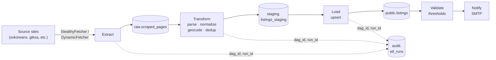

# Korean Rental ETL

## Table of Contents

- [Overview](#overview)
- [Architecture](#architecture)
- [Sources](#sources)
- [Quick Start](#quick-start)
- [Operator's Guide](#operators-guide)
  - [Prerequisites](#prerequisites)
  - [Configuration](#configuration)
  - [Service Ports](#service-ports)
  - [Deploying](#deploying)
  - [Verifying the Deployment](#verifying-the-deployment)
  - [Triggering DAGs](#triggering-dags)
  - [Viewing Logs](#viewing-logs)
  - [Troubleshooting](#troubleshooting)
  - [Before Exposing Publicly](#before-exposing-publicly)
- [Developer's Guide](#developers-guide)
  - [Local Setup](#local-setup)
  - [Make Targets](#make-targets)
  - [Project Structure](#project-structure)
  - [Running Tests](#running-tests)
  - [CLI Command Reference](#cli-command-reference)
  - [Adding a New Source](#adding-a-new-source)
  - [Database Schema](#database-schema)
  - [Migrations](#migrations)
- [DAG Schedules](#dag-schedules)
- [License](#license)

## Overview

ETL pipeline for scraping, transforming, and loading Korean rental listings from community boards. Extracts HTML from six sources, parses and normalizes Korean text, geocodes addresses, deduplicates listings, and loads into PostgreSQL with full-text search. Orchestrated by Apache Airflow on a 6-hour schedule with audit logging and validation thresholds.

## Architecture



**Extract**: Scrapling-based scrapers with Cloudflare bypass (StealthyFetcher, DynamicFetcher).  
**Transform**: Korean text normalization, Nominatim geocoding, fuzzy + hash deduplication, trigram FTS indexing.  
**Load**: PostgreSQL with PostGIS and pg_trgm extensions; upsert with audit trail.  
**Orchestration**: Apache Airflow LocalExecutor; 6-hour schedule with email alerts via MailHog (dev) or SMTP relay (prod).

## Sources

| Name | URL | Status |
|------|-----|--------|
| svkoreans | https://svkoreans.com/rent_housing | Active |
| gtksa | https://gtksa.net/bbs/board.php?bo_table=rent | Active |
| missyusa | https://missyusa.com/town9 | Active |
| ktown_koreadaily | https://ktown.koreadaily.com/ad_rent/rentlist | Active |
| radiokorea | https://m.radiokorea.com/c_realestate | Active |
| hanintown | https://hanintown.com | Disabled |

## Quick Start

```bash
# Clone and configure
git clone <repo-url>
cd koreaRentalETL
cp .env.example .env
# Edit .env and set POSTGRES_PASSWORD, AIRFLOW_DB_PASSWORD, AIRFLOW_ADMIN_PASSWORD

# Start the stack
docker compose up -d --build

# Access services
# Airflow WebUI:  http://localhost:8080 (admin/admin by default)
# MailHog:        http://localhost:8025
# PostgreSQL:     localhost:5432
# Redis:          localhost:6379
```

## Operator's Guide

### Prerequisites

- Ubuntu 22.04 LTS or later
- Docker Engine ≥ 24.0
- Docker Compose v2 plugin
- Ports 8080, 5432, 5433, 6379, 1025, 8025 available

### Configuration

Copy `.env.example` to `.env` and edit the following keys:

| Key | Required | Default | Description |
|-----|----------|---------|-------------|
| `POSTGRES_PASSWORD` | Yes | `change_me_in_production` | PostgreSQL app DB password |
| `AIRFLOW_DB_PASSWORD` | Yes | `change_me_in_production` | Airflow metadata DB password |
| `AIRFLOW_ADMIN_PASSWORD` | Yes | `change_me_in_production` | Airflow web UI admin password |
| `POSTGRES_USER` | No | `etl_user` | PostgreSQL app DB user |
| `POSTGRES_DB` | No | `korean_rental` | PostgreSQL app DB name |
| `POSTGRES_PORT` | No | `5432` | PostgreSQL app DB port |
| `REDIS_PORT` | No | `6379` | Redis port |
| `NOMINATIM_USER_AGENT` | No | `korean-rental-etl/0.1.0 (contact@example.com)` | Nominatim geocoding user agent |
| `NOMINATIM_RATE_LIMIT_PER_SEC` | No | `1` | Nominatim requests per second |
| `DOWNLOAD_DELAY_SEC` | No | `2.0` | Scraper delay between requests |
| `CONCURRENT_REQUESTS` | No | `2` | Scraper concurrent request limit |
| `MAX_RETRIES` | No | `3` | Scraper retry count |
| `SMTP_HOST` | No | `localhost` | SMTP server for Airflow alerts |
| `SMTP_PORT` | No | `1025` | SMTP port |
| `SMTP_TO` | No | `admin@example.com` | Email recipient for Airflow alerts |
| `LOG_LEVEL` | No | `INFO` | Application log level |

### Service Ports

| Service | Port | Purpose |
|---------|------|---------|
| Airflow WebUI | 8080 | DAG monitoring and triggering |
| PostgreSQL (app) | 5432 | Korean rental listings database |
| PostgreSQL (Airflow) | 5433 | Airflow metadata database |
| Redis | 6379 | Deduplication cache |
| MailHog SMTP | 1025 | Email relay (dev only) |
| MailHog WebUI | 8025 | Email inbox viewer (dev only) |

### Deploying

```bash
# Build and start all services
docker compose up -d --build

# Verify services are running
docker compose ps

# Check service health
docker compose ps --filter "health=healthy"
```

The `airflow-init` service runs migrations and creates the admin user automatically. Wait ~30 seconds for all services to become healthy.

### Verifying the Deployment

```bash
# Run the smoke test
make verify-deploy
```

This target:
1. Brings down and removes volumes (fresh start)
2. Builds and starts the full stack
3. Waits for services to become healthy
4. Verifies the `korean-rental-etl` package is installed in the Airflow container
5. Verifies the CLI is on PATH inside the container
6. Verifies all DAGs import without errors

### Triggering DAGs

**Via Airflow WebUI:**
1. Open http://localhost:8080
2. Log in with admin / `AIRFLOW_ADMIN_PASSWORD`
3. Find `korean_rental_full_etl` or `korean_rental_cleanup` in the DAG list
4. Click the DAG name, then click the play icon to trigger

**Via CLI:**
```bash
# Run the full ETL pipeline once
docker compose exec airflow-scheduler korean-rental-etl run-all

# Or run individual steps
docker compose exec airflow-scheduler korean-rental-etl extract --all
docker compose exec airflow-scheduler korean-rental-etl transform --all
docker compose exec airflow-scheduler korean-rental-etl load
docker compose exec airflow-scheduler korean-rental-etl validate --run-id <run-id>
```

### Viewing Logs

**Airflow task logs:**
```bash
# Stream logs from the scheduler
docker compose logs -f airflow-scheduler

# Stream logs from the webserver
docker compose logs -f airflow-webserver

# View task logs in the WebUI: DAG → Task Instance → Logs tab
```

**Application logs:**
```bash
# Logs are written to the airflow_logs named volume
# Access via: docker compose exec airflow-scheduler tail -f /opt/airflow/logs/<dag_id>/<task_id>/<run_id>/attempt-1.log
```

### Troubleshooting

**Port already in use:**
```bash
# Find which process is using the port (e.g., 8080)
lsof -i :8080
# Kill it or change the port in docker-compose.yml
```

**airflow-init fails or hangs:**
```bash
# Check the init logs
docker compose logs airflow-init

# If it's stuck, restart it
docker compose restart airflow-init

# Verify the Airflow metadata DB is healthy
docker compose exec airflow_postgres pg_isready -U airflow
```

**DAG import errors:**
```bash
# Check for syntax errors in DAG files
docker compose exec airflow-scheduler python -m py_compile /opt/airflow/dags/*.py

# View the full DAG bag report
docker compose exec airflow-scheduler python -c "from airflow.models import DagBag; db = DagBag(include_examples=False); print(db.import_errors)"
```

**PostgreSQL healthcheck failing:**
```bash
# Verify the password is correct in .env
docker compose exec postgres psql -U etl_user -d korean_rental -c "SELECT 1"

# Check Postgres logs
docker compose logs postgres
```

**Redis connection refused:**
```bash
# Verify Redis is running
docker compose exec redis redis-cli ping

# Check Redis logs
docker compose logs redis
```

### Before Exposing Publicly

> ⚠ **Before exposing publicly**: This deployment uses default passwords (`change_me_in_production`), binds all services to all interfaces (0.0.0.0), has no TLS on the Airflow WebUI, and uses MailHog (a dev-only mail sink) for email alerts. Before deploying to a public-facing server, change all passwords in `.env`, restrict port bindings to `127.0.0.1` or a private network, front Airflow with a reverse proxy (nginx/Caddy) with TLS, and configure a real SMTP relay (AWS SES, SendGrid, etc.) for production email alerts. See your cloud provider's documentation for hardening guidance.

## Developer's Guide

### Local Setup

```bash
# Install dependencies with dev and test extras
make dev

# Or manually with uv
uv sync --extra dev --extra test
```

### Make Targets

| Target | Purpose |
|--------|---------|
| `make help` | Show all available targets |
| `make install` | Install project dependencies |
| `make dev` | Install with dev and test extras |
| `make lint` | Run ruff linter and formatter check |
| `make format` | Auto-format code with ruff |
| `make typecheck` | Run mypy type checker |
| `make test` | Run unit tests with coverage (80% gate on transform module) |
| `make test-integration` | Run integration tests (requires Docker Compose) |
| `make ci` | Run full CI pipeline (lint + typecheck + test) |
| `make smoke` | Run smoke tests (DAG imports + CLI version) |
| `make verify-deploy` | Verify production-ready containerized deployment |
| `make clean` | Clean build artifacts and caches |

### Project Structure

```
src/korean_rental_etl/
├── cli/
│   └── cli.py                 # Click CLI entry point
├── extract/
│   ├── base_scraper.py        # Abstract scraper base class
│   ├── scraper_factory.py     # Scraper instantiation
│   ├── scrapers/              # Concrete scraper implementations
│   │   ├── svkoreans.py
│   │   ├── gtksa.py
│   │   ├── missyusa.py
│   │   ├── ktown_koreadaily.py
│   │   └── radiokorea.py
│   ├── raw_writer.py          # Write raw HTML to raw.scraped_pages
│   └── source_config.py       # Load sources from config/sources.yml
├── transform/
│   ├── pipeline.py            # Main transform orchestration
│   ├── parsers/               # HTML parsers per source
│   ├── normalizers/           # Korean text normalization
│   ├── dedup/                 # Fuzzy + hash deduplication
│   └── staging_writer.py      # Write to staging.listings_staging
├── load/
│   ├── upserter.py            # Upsert staging → public.listings
│   ├── cleanup.py             # Mark stale, purge old pages
│   └── audit.py               # Audit trail logging
├── validation/
│   └── thresholds.py          # Validation rules and checks
├── db/
│   ├── connection.py          # PostgreSQL connection pool
│   └── models.py              # SQLAlchemy ORM models
└── text_utils.py              # Korean text utilities

tests/
├── unit/                      # Unit tests (no external services)
│   ├── cli/
│   ├── extract/
│   ├── transform/
│   ├── load/
│   └── validation/
└── integration/               # Integration tests (requires Docker)
    ├── full_etl_dag/
    ├── load/
    └── db/

airflow/
└── dags/
    ├── full_etl.py            # 6-hour ETL pipeline
    └── cleanup.py             # Daily cleanup tasks

sql/
└── migrations/
    ├── 001_initial_schema.sql # Core schema + sources seed
    └── 002_fix_fts_index.sql  # FTS index NULL handling fix
```

### Running Tests

**Unit tests (fast, no Docker required):**
```bash
make test
```

**Integration tests (requires Docker Compose):**
```bash
make test-integration
```

**Full CI (lint + typecheck + unit tests):**
```bash
make ci
```

Note: The coverage gate requires 80% coverage on the `transform` module. Pre-existing mypy errors in `transform/` and `extract/` are known and out of scope for this release.

### CLI Command Reference

| Command | Flags | Purpose |
|---------|-------|---------|
| `korean-rental-etl sources list` | — | List all configured sources |
| `korean-rental-etl sources show <name>` | — | Show details for a source |
| `korean-rental-etl extract` | `--source <name>` or `--all`, `--dag-id`, `--run-id` | Extract listings from sources |
| `korean-rental-etl transform` | `--source <name>` or `--all`, `--limit N`, `--dag-id`, `--run-id` | Transform extracted listings |
| `korean-rental-etl load` | `--source <name>`, `--dag-id`, `--run-id` | Load transformed listings |
| `korean-rental-etl validate` | `--run-id <id>` | Validate loaded listings |
| `korean-rental-etl run-all` | `--dag-id`, `--run-id` | Run full pipeline (extract → transform → load → validate) |
| `korean-rental-etl cleanup mark-stale` | `--days N` | Mark listings inactive if not seen in N days |
| `korean-rental-etl cleanup purge-pages` | `--days N` | Delete raw HTML pages older than N days |

### Adding a New Source

1. **Add source to `config/sources.yml`:**
   ```yaml
   - name: newsource
     display_name: New Source
     base_url: https://newsource.com/listings
     fetcher_type: StealthyFetcher
     schedule_cron: "0 */6 * * *"
     is_active: true
   ```

2. **Create scraper in `src/korean_rental_etl/extract/scrapers/newsource.py`:**
   ```python
   from korean_rental_etl.extract.base_scraper import BaseScraper
   
   class NewSourceScraper(BaseScraper):
       def crawl_list_pages(self):
           # Yield (url, html_content) tuples
           pass
       
       def fetch_detail(self, url):
           # Return detail page HTML
           pass
   ```

3. **Create parser in `src/korean_rental_etl/transform/parsers/newsource.py`:**
   ```python
   from korean_rental_etl.transform.parsers.base_parser import BaseParser
   
   class NewSourceParser(BaseParser):
       def parse(self, html):
           # Return dict with keys: title_ko, body_ko, raw_price, raw_location, etc.
           pass
   ```

4. **Register in `src/korean_rental_etl/extract/scraper_factory.py`:**
   ```python
   elif source_config.name == "newsource":
       return NewSourceScraper(source_config, source_id)
   ```

5. **Create migration `sql/migrations/NNN_add_newsource.sql`:**
   ```sql
   INSERT INTO public.sources (name, display_name, base_url, fetcher_type, schedule_cron, is_active)
   VALUES ('newsource', 'New Source', 'https://newsource.com/listings', 'StealthyFetcher', '0 */6 * * *', TRUE);
   ```

6. **Write tests in `tests/unit/extract/test_newsource_scraper.py` and `tests/unit/transform/test_newsource_parser.py`.**

### Database Schema

**`public` schema:**
- `sources` — Registry of scraping sources (name, URL, fetcher type, schedule, active status)
- `listings` — Final clean listings (title, body, price, location, contact, category, geo_point, dedup flags, timestamps)

**`raw` schema:**
- `scraped_pages` — Raw HTML from sources (source_id, url, html_content, content_hash, fetched_at)

**`staging` schema:**
- `listings_staging` — Parsed but not yet loaded listings (intermediate state with errors, dedup flags, parsed_at, loaded_at)

**`audit` schema:**
- `etl_runs` — Audit trail of ETL executions (dag_id, task_id, run_id, source_name, status, row counts, timestamps)

**Key indexes:**
- Trigram FTS on `listings(COALESCE(title_ko,'') || ' ' || COALESCE(body_ko,'') || ' ' || COALESCE(address_raw,''))` for Korean full-text search
- GiST on `listings(geo_point)` for geographic queries
- B-tree on `listings(source_id, is_active, posted_at_utc, last_seen_at)` for common filters

### Migrations

Migrations are SQL files in `sql/migrations/` with numeric prefixes (e.g., `001_initial_schema.sql`, `002_fix_fts_index.sql`). They are applied automatically when the PostgreSQL container starts via the `docker-entrypoint-initdb.d` mechanism. To add a new migration:

1. Create `sql/migrations/NNN_description.sql` (increment NNN)
2. Write idempotent SQL (use `IF NOT EXISTS`, `ON CONFLICT`, etc.)
3. Commit and push
4. On next `docker compose up`, the migration runs automatically

For existing databases, manually run the migration:
```bash
docker compose exec postgres psql -U etl_user -d korean_rental -f /docker-entrypoint-initdb.d/NNN_description.sql
```

## DAG Schedules

| DAG | Schedule | Tasks |
|-----|----------|-------|
| `korean_rental_full_etl` | Every 6 hours (0 */6 * * *) | health_check → extract → transform → load → validate → notify |
| `korean_rental_cleanup` | Daily at 03:00 UTC (0 3 * * *) | mark_stale_listings_inactive → purge_old_raw_pages |

## License

MIT
